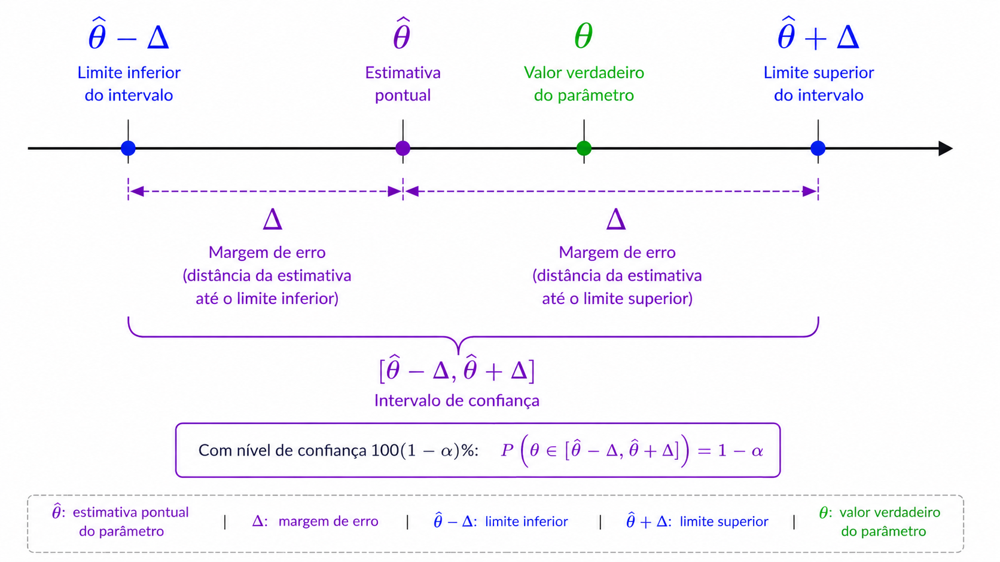
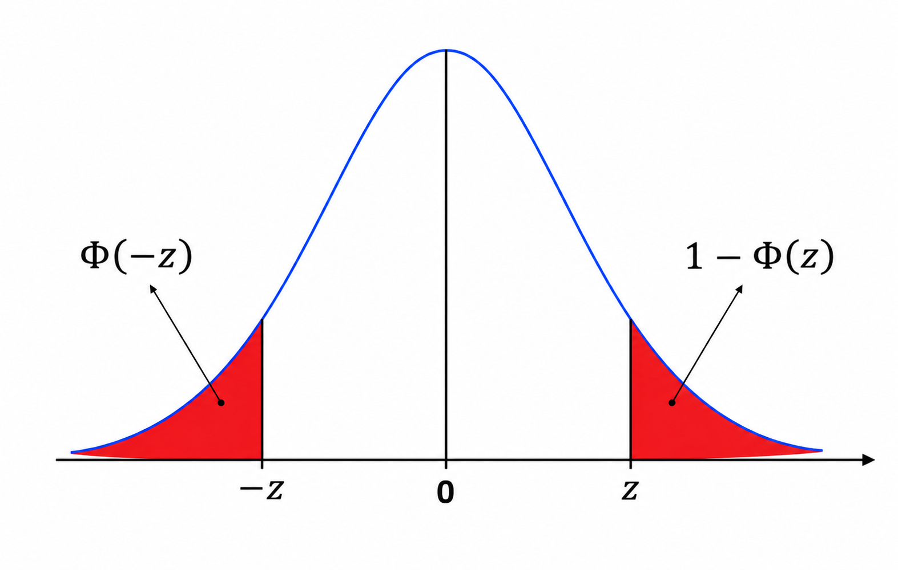
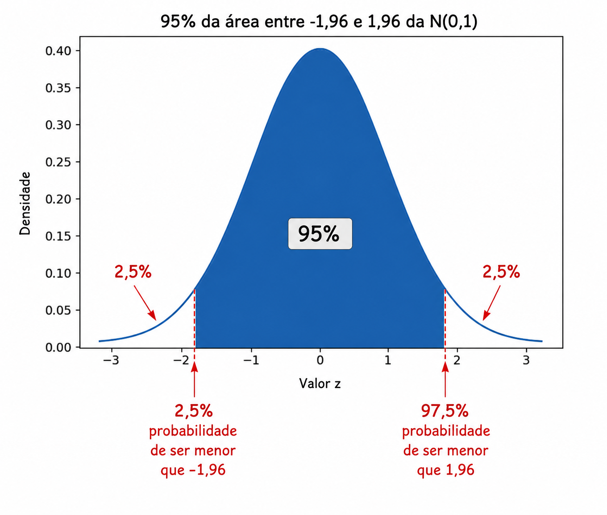

# Estimação por Intervalos: Intervalo de Confiança

## Motivação para Intervalos de Confiança

Os intervalos de confiança são utilizados no contexto frequentista, no qual os parâmetros populacionais são assumidos como desconhecidos, porém fixos, e não variáveis aleatórias. Enquanto isso, os intervalos de credibilidade (Paradigma Bayesiano) constituem a versão bayesiana dos intervalos de confiança frequentistas em que os parâmetros são tratados como variáveis aleatórias.

Quando realizamos estimação pontual (como Máxima Verossimilhança ou Método dos Momentos), a probabilidade de nossa resposta estar exatamente correta (considerando a aleatoriedade das amostras iid) é

$$P(\hat{\theta} = \theta) = 0,$$ porque $\theta$ é um número real e pode assumir uma quantidade incontável de valores. Portanto, a probabilidade de estarmos exatamente corretos é zero, embora possamos estar muito próximos do valor verdadeiro.

Em vez disso, podemos fornecer um intervalo (frequentemente, mas não necessariamente, centrado na estimativa pontual $\hat{\theta}$) tal que $\theta$ pertença a esse intervalo com alta probabilidade, por exemplo 95%:

$$P(\theta \in [\hat{\theta} - \Delta; \hat{\theta} + \Delta]) = 0{,}95.$$ O valor $\Delta$ é denominado **margem de erro** e determina a amplitude do intervalo de confiança. A expressão anterior pode ser escrita de maneiras equivalentes:

$$P\left(\theta \in [\hat{\theta} - \Delta; \hat{\theta} + \Delta]\right) = P\left(|\hat{\theta}-\theta| \leq \Delta\right) = P\left(
\hat{\theta}
\in
[\theta-\Delta,\theta+\Delta]
\right).$$

Todas essas expressões representam a probabilidade de que a distância entre o estimador e o parâmetro verdadeiro não ultrapasse $\Delta$.

O intervalo de confiança para $\theta$ pode ser representado como a Figura abaixo. Mais adiante, discutiremos como deve ser interpretado um intervalo de confiança associado a um nível de confiança específico.



## Revisão: Distribuição Normal Padrão

Grande parte da teoria dos intervalos de confiança baseia-se na distribuição normal padrão

$$Z \sim N(0,1).$$

Sua função distribuição acumulada é denotada por

$$\Phi(z)=P(Z\leq z).$$

Uma propriedade importante da distribuição normal é sua simetria:

$$\Phi(z)=1-\Phi(-z).$$



Suponha que desejemos construir um intervalo centrado tal que a probabilidade de um valor pertencer a esse intervalo seja de 95%. Note que (observe a Figura abaixo):

- **Limite inferior:** a probabilidade de um valor ser menor que o limite inferior é de 2,5%.

- **Limite superior:** a probabilidade de um valor ser maior que o limite superior é de 2,5%.

Consequentemente, a probabilidade de um valor ser menor que o limite superior deve ser de 97,5%.



Para construir um intervalo central de 95%, precisamos encontrar um valor $z$ tal que 95% da área esteja entre $-z$ e $z$. O valor de $z$ pode ser encontrar usando o `R` ou usando alguma tabela da normal padrão (existem várias configurações). Daí, temos que:

$$z=\Phi^{-1}(0.975)=1{,}96.$$

Assim,

$$P(-1{,}96 \leq Z \leq 1{,}96)=0{,}95.$$

O valor 1,96 é conhecido como o valor crítico associado a um nível de confiança de 95%.

## Construção de um Intervalo de Confiança

**Exemplo:** Distribuição de Poisson

Suponha que

$$X_1,\ldots,X_n \stackrel{iid}{\sim} \text{Poi}(\theta),$$

em que $\theta$ é desconhecido.

Sabemos que tanto o estimador de máxima verossimilhança quanto o estimador pelo método dos momentos são dados pela média amostral

$$\frac{1}{n}
\sum_{i=1}^{n}X_i.$$

Como

$$E(X_i)=\theta
\quad\text{e}\quad
Var(X_i)=\theta,$$

segue que

$$E(\hat{\theta})=\theta$$

e

$$Var(\hat{\theta}) = \frac{\theta}{n}.$$

Pelo Teorema Central do Limite,

$$\hat{\theta}
\approx
N\left(
\theta,
\frac{\theta}{n}
\right).$$

Padronizando,

$$\frac{\hat{\theta}-\theta}
{\sqrt{\theta/n}}
\approx
N(0,1).$$

Desejamos construir um intervalo de confiança de 95%, ou seja, $0{,}95$. Utilizando o valor crítico $z_{0{,}975}=1{,}96$, obtemos

$$\Delta = 1{,}96
\sqrt{\frac{\theta}{n}}.$$

Como $\theta$ é desconhecido, substituímos pelo estimador $\hat{\theta}$:

$$\left[\hat{\theta} - 1{,}96
\sqrt{\frac{\hat{\theta}}{n}}
;
\hat{\theta}
+
1{,}96
\sqrt{\frac{\hat{\theta}}{n}}
\right].$$

::: {.callout-note title="Definição: Intervalo de Confiança"}
Suponha que você possua uma amostra aleatória $X_1,\ldots,X_n$ de uma distribuição com parâmetro desconhecido $\theta$, e que disponha de um estimador $\hat{\theta}$ para esse parâmetro.

Um intervalo de confiança de nível $100(1-\alpha)\%$ para $\theta$ é um intervalo (tipicamente, mas nem sempre, centrado em $\hat{\theta}$), $[\hat{\theta}-\Delta,\hat{\theta}+\Delta],$ tal que a probabilidade (considerando a aleatoriedade das amostras $X_1,\ldots,X_n$) de o parâmetro $\theta$ pertencer a esse intervalo seja igual a $1-\alpha$:

$$P\left(\theta \in [\hat{\theta} - \Delta; \hat{\theta} + \Delta]\right) = 1-\alpha.$$ Quando $\hat{\theta} = \frac{1}{n}\sum_{i=1}^{n}X_i$ é a média amostral, o Teorema Central do Limite garante que $\hat{\theta}$ possui distribuição aproximadamente normal para amostras suficientemente grandes. Nesse caso, um intervalo de confiança de nível $100(1-\alpha)\%$ é dado por

$$\left[\hat{\theta} - z_{1-\alpha/2}\frac{\sigma}{\sqrt{n}}
;
\hat{\theta}
+
z_{1-\alpha/2}\frac{\sigma}{\sqrt{n}}
\right],$$

em que $z_{1-\alpha/2}$ é o quantil da distribuição Normal padrão e $\sigma$ representa o verdadeiro desvio-padrão de uma observação da população, o qual pode precisar ser estimado a partir dos dados.
:::

É importante observar que a fórmula apresentada anteriormente funciona apenas quando $\hat{\theta}$ é a média amostral. Nesse caso, podemos utilizar o Teorema Central do Limite para concluir que a distribuição de $\hat{\theta}$ é aproximadamente normal. Quando o estimador não é a média amostral, essa aproximação pode não ser válida, sendo necessário recorrer a outras estratégias para construir intervalos de confiança.

Se desejarmos um intervalo de confiança de 95%, então $100(1-\alpha)= 95$, o que implica $\alpha=0.05$. Nesse caso, devemos encontrar o quantil da distribuição Normal padrão correspondente a $1-\frac{0.05}{2} = 0.975$. Consultando uma tabela da distribuição Normal padrão ou utilizando um software estatístico, obtemos $\Phi^{-1}(0.975)= 1.96$. Isso significa que um intervalo de confiança de 95% é obtido considerando aproximadamente 1,96 desvios-padrão para cada lado da estimativa pontual.

De maneira análoga, se desejarmos um intervalo de confiança de 98%, teremos $100(1-\alpha)=98,$ e, portanto, $\alpha=0.02$. Logo, $1-\frac{0.02}{2} = 0,99$, assim, devemos calcular $\Phi^{-1}(0.99)$. A razão para isso é simples: se desejamos que 98% da área da distribuição esteja concentrada na região central, os 2% restantes devem ser distribuídos igualmente entre as duas caudas da distribuição. Consequentemente, teremos 1% da área à esquerda e 1% da área à direita.

**Exemplo:** Intervalo de Confiança para uma Proporção

Considere uma amostra de tamanho $n=400$ de uma distribuição Bernoulli com parâmetro $\theta$. Suponha que foram observados 136 sucessos.

A estimativa pontual é

$$\hat{\theta} =  \frac{136}{400} = 0.34.$$

Desejamos construir um intervalo de confiança de 99%. Temos

$$\alpha = 1- \frac{99}{100} = 0.01$$

e, portanto, $z_{0.995} = 2.576$. Como

$$Var(X)=\theta(1-\theta),$$

estimamos o desvio-padrão por

$$\sigma = \sqrt{\hat{\theta}(1-\hat{\theta})} =
\sqrt{0.34\times0.66} = 0.474.$$

Logo,

$$\left[0.34 - 2.576\frac{0.474}{\sqrt{400}}
;
0.34
+
2.576\frac{0.474}{\sqrt{400}}
\right].$$

Após os cálculos, temos

$$IC(\theta,0{,}99) = [0.279;0.401].$$ <!-- **Exemplo:** Intervalo de Confiança para média da distribuição exponencial --> <!-- Sejam $X_1, \dots, X_n$ iid exponencial $Exp(\lambda) = Gama(1, 1/\lambda)$. --> <!-- Então, --> <!-- $$\sum\limits{i=1}^n X_i \sim Gama(n, 1/\lambda) 2\lambda \sum\limits{i=1}^n X_i --> <!-- \sim Gama(n,2) = \chi^2_{2n}.$$ Considere $\alpha = 0{,}05$. Sejam $A$ e $B$ --> <!-- (ambos positivos) tal que --> <!-- $$P(A \leq 2\lambda \sum\limits{i=1}^n X_i \leq B ) = 0{,}95$$ -->

## Interpretação de um Intervalo de Confiança

Uma interpretação muito comum, mas incorreta, é afirmar:

> Existe 99% de probabilidade de que $\theta$ pertença ao intervalo $[0.279;0.401]$.

Essa afirmação está errada porque $\theta$ é um parâmetro fixo. Após observarmos os dados, o intervalo já foi determinado e $\theta$ está dentro dele ou não está.

A interpretação correta é:

> Se repetirmos o procedimento de amostragem e construção do intervalo muitas vezes, aproximadamente 99% dos intervalos construídos conterão o verdadeiro valor de $\theta$.

Portanto, o nível de confiança refere-se ao método de construção do intervalo e não à probabilidade de o parâmetro pertencer ao intervalo específico obtido.

## Intervalo de confiança para média com variância conhecida

Se o desvio padrão populacional $\sigma$ for conhecido, o intervalo de confiança para média baseado na distribuição normal pode ser utilizado para qualquer tamanho de amostra. Nesse caso, basta calcular:

$$\left(
\bar{x} - z_{1-\alpha/2}\frac{\sigma}{\sqrt{n}},
\;
\bar{x} + z_{1-\alpha/2}\frac{\sigma}{\sqrt{n}}
\right)$$

ou, de forma equivalente,

$$\bar{x} \pm z_{1-\alpha/2}\frac{\sigma}{\sqrt{n}},$$

em que:

- $\bar{x}$ é a média amostral;
- $\sigma$ é o desvio padrão populacional;
- $n$ é o tamanho da amostra;
- $z_{1-\alpha/2}$ é o quantil de ordem $1-\frac{\alpha}{2}$ da distribuição normal padrão para o nível de confiança desejado

Quando a variância populacional é conhecida, o intervalo de confiança baseado na distribuição normal fornece uma estimativa exata para a média da população, desde que os dados sejam provenientes de uma distribuição normal. No exemplo a seguir, mostramos como calcular esse intervalo de confiança utilizando `Python`.

```{python}
import numpy as np
from scipy.stats import norm

dados = [12, 15, 14, 10, 13, 16, 14, 15]

sigma = 2.5      # desvio padrão populacional conhecido
alpha = 0.05     # IC de 95%

n = len(dados)
media = np.mean(dados)

# Quantil da normal padrão
z = norm.ppf(1 - alpha/2)

# Margem de erro
erro = z * sigma / np.sqrt(n)

# Intervalo de confiança
lim_inf = media - erro
lim_sup = media + erro

print(f"Média: {media:.2f}")
print(f"IC 95%: ({lim_inf:.2f}, {lim_sup:.2f})")
```

## Intervalo de confiança para média com variância desconhecida (amostra grande)

Quando o objetivo é estimar a média populacional $\mu$ de uma distribuição normal e a variância populacional é desconhecida, um intervalo de confiança aproximado de $100(1-\alpha)\%$, considerando uma amostra suficientemente grande, pode ser obtido pela aproximação normal:

$$\left(
\bar{x} - z_{1-\alpha/2}\frac{s}{\sqrt{n}},
\;
\bar{x} + z_{1-\alpha/2}\frac{s}{\sqrt{n}}
\right)$$

ou, de forma abreviada,

$$\bar{x} \pm z_{1-\alpha/2}\frac{s}{\sqrt{n}},$$

em que:

- $\bar{x}$ é a média amostral;
- $s$ é o desvio padrão amostral;
- $n$ é o tamanho da amostra;
- $z_{1-\alpha/2}$ é o quantil de ordem $1-\frac{\alpha}{2}$ da distribuição normal padrão para o nível de confiança desejado.

::: callout-warning
## Importante

Este intervalo é uma **aproximação** e deve ser utilizado apenas quando o tamanho da amostra é suficientemente grande, isto é, $n > 200$. Para amostras menores, recomenda-se utilizar o intervalo baseado na distribuição **t-Student**, que leva em consideração a incerteza decorrente da estimativa da variância populacional.
:::

## Intervalo de confiança para média com variância desconhecida

Um intervalo de confiança de $100\cdot (1-\alpha)\%$ para média $\mu$ de uma distribuição normal com variância desconhecida é dada por:

$$\left(\bar{x} - t_{1-\frac{\alpha}{2}, n-1}\frac{s}{\sqrt{n}}, \bar{x} + t_{1-\frac{\alpha}{2}, n-1}\frac{s}{\sqrt{n}}\right),$$

ou se maneira abreviada

$$\bar{x} \pm t_{1-\frac{\alpha}{2}, n-1}\frac{s}{\sqrt{n}},$$

em que $\bar{x}$ é a média amostral, $s$ é o desvio padrão amostral, $n$ é o tamanho da amostra e $t_{1-\frac{\alpha}{2}}$ o quantil de ordem $1-\frac{\alpha}{2}$ da distribuição $t$-Student com $n-1$ graus de liberdade.

A seguir, é apresentada uma função do `Python` que pode ser utilizada para construir intervalos de confiança para média.

```{python}
import numpy as np
import statsmodels.stats.api as sms

dados = [12, 15, 14, 10, 13, 16, 14, 15]

lim_inf, lim_sup = sms.DescrStatsW(dados).tconfint_mean(alpha=0.05)

print(f"IC 95%: ({lim_inf:.2f}, {lim_sup:.2f})")
```


## Fatores que Afetam a Amplitude de um Intervalo de Confiança

A amplitude de um intervalo de confiança de $100\cdot(1-\alpha)\%$ para a média $\mu$ é dada por:

$$
2\cdot t_{1-\frac{\alpha}{2},\;n-1}\frac{s}{\sqrt{n}},
$$

sendo determinada por três fatores principais: o tamanho da amostra ($n$), o desvio padrão amostral ($s$) e o nível de confiança ($1-\alpha$).

### Tamanho da amostra ($n$)

À medida que o tamanho da amostra aumenta, a amplitude do intervalo de confiança diminui. Isso ocorre porque amostras maiores fornecem estimativas mais precisas da média populacional.

### Desvio padrão ($s$)

Quanto maior o desvio padrão amostral, maior será a amplitude do intervalo de confiança. Isso acontece porque um maior desvio padrão indica maior variabilidade nos dados, aumentando a incerteza na estimativa da média.

### Nível de confiança ($1-\alpha$)

Quanto maior o nível de confiança desejado (ou, equivalentemente, quanto menor o valor de $\alpha$, maior será a amplitude do intervalo de confiança. Isso ocorre porque níveis de confiança mais elevados exigem intervalos mais amplos para aumentar a chance de conter o verdadeiro valor da média populacional.


## Método de Wald para obter um intervalo de confiança para proporção

Um intervalo de confiança aproximado de $100\cdot (1-\alpha)\%$ para o parâmetro $p$ de uma binomial, baseado na baseado na aproximação normal da distribuição binomial, é dado por:

$$\hat{p} \pm z_{1-\frac{\alpha}{2}}\sqrt{\frac{\hat{p}(1-\hat{p})}{n}},$$

em que $\hat{p}$ é a proporção amostral de "sucessos", $n$ é o tamanho da amostra e $z_{1-\frac{\alpha}{2}}$ é o quantil de ordem $1-\frac{\alpha}{2}$ da distribuição normal padrão.

> Este método de estimação de intervalo só deve ser utilizado se: $n\hat{p}(1-\hat{p}) \geq 5$.

Abaixo é apresentado um código que calcula um intervalo de confiança aproximado para o parâmetro $p$ da binomial usando a função `proportion_confint` do `statsmodels`.

```{python}
from statsmodels.stats.proportion import proportion_confint

x = 12   # número de sucessos
n = 50   # tamanho da amostra
alpha = 0.05  # IC de 95%

lim_inf, lim_sup = proportion_confint(
    count=x,
    nobs=n,
    alpha=alpha,
    method="normal"   # Wald (aproximado)
)

print(f"IC: ({lim_inf:.2f}, {lim_sup:.2f})")
```

## Método Exato para Obtenção de IC para o parâmetro $p$ da binomial (Método de Clopper–Pearson)

Um intervalo de confiança exato de $100\cdot(1−α)\%$ para o parâmetro $p$ da binomial, que é sempre válido, é dado por $(p_1, p_2)$, em que $p_1$ e $p_2$ satisfazem as seguintes condições baseadas na distribuição binomial:

$$P(X \ge x \mid p_1) = \sum_{k=x}^{n} \binom{n}{k} p_1^k (1 - p_1)^{n-k} = \frac{\alpha}{2}$$

e

$$P(X \le x \mid p_2) = \sum_{k=0}^{x} \binom{n}{k} p_2^k (1 - p_2)^{n-k} = \frac{\alpha}{2},$$

em que $X$ é uma variável aleatória com distribuição Binomial, $x$ é o número observado se sucessos, $n$ o tamanho da amostra, $p_1$ é o limite inferior do intervalo, $p_2$ é o limite superior do intervalo e $\alpha$ é o nível de significância.

Abaixo o código que calcula um intervalo de confiança exato (Clopper–Pearson) para o parâmetro $p$ da binomial usando a função `proportion_confint` do `statsmodels`.

```{python}
from statsmodels.stats.proportion import proportion_confint

x = 12   # número de sucessos
n = 50   # tamanho da amostra
alpha = 0.05  # IC de 95%

lim_inf, lim_sup = proportion_confint(
    count=x,
    nobs=n,
    alpha=alpha,
    method="beta"   # Clopper-Pearson (exato)
)

print(f"IC: ({lim_inf:.2f}, {lim_sup:.2f})")
```

> A função `proportion_confint` apresenta outros métodos como: "wilson", "agresti_coull" e "jeffreys".

## Exercícios

1.  (CESPE / CEBRASPE - 2026 - Telebras - Especialista em Gestão de Telecomunicações - Analista Superior - Subatividade: Estatística) Para avaliação da audiência do telejornal de certa emissora de televisão em determinado mês de 2025, mediram-se os pontos de audiência do programa em 25 dias desse mês, tendo sido obtido um valor médio de 34,7 pontos. Pesquisas anteriores apontaram um desvio padrão populacional de 3,50 pontos de audiência desse telejornal.

A partir dessa situação hipotética, e supondo que a audiência do telejornal siga uma distribuição normal, julgue o item subsecutivo, assumindo um nível de confiança de 94% ($z_{1−\alpha/2} = 1{,}88$).

Infere-se das informações apresentadas que o intervalo de confiança para a média dos pontos de audiência em todo o mês é dado por $\text{IC}(\mu, 0,94) = [33,38; 36,02]$.

( ) Certo

( ) Errado

2.  (FCC - 2025 - Prefeitura de São Paulo - SP - Auditor Municipal de Controle Interno - AMCI Área de Especialização: Geral) A população formada pelos tempos de durações de atendimento a uma pessoa em um quichê de um órgão público é considerada normalmente distribuída com uma variância populacional igual a 2,56 (minutos)$^2$. Uma amostra aleatória de tamanho 64 foi extraída, com reposição, dessa população, obtendo-se uma média amostral igual a 15 minutos. Com base na amostra, um intervalo de confiança de 95% foi construído para a média populacional, considerando que na curva normal padrão (Z) as probabilidades $P(Z < 1,64)= 95\%$ e $P(Z < 1,96) = 97,5\%$. O limite superior do intervalo encontrado apresenta um valor igual a

<!-- -->

(a) 15,6272

(b) 15,3920

(c) 15,5248

(d) 15,4018

(e) 15,5160

<!-- -->

3.  (FCC - 2025 - Prefeitura de São Paulo - SP - Analista de Planejamento e Desenvolvimento Organizacional Tecnologia da Informação e Comunicação) A população formada pelos salários, em salários mínimos (SM), dos empregados de uma prefeitura é normalmente distribuída com uma variância populacional igual a 2,25 SM$^2$. Extraindo uma amostra aleatória desta população, com reposição, de tamanho 100, encontrou-se uma média amostral igual a 4,8 SM. Utilizando as informações da curva normal padrão (Z) que as probabilidades $P(Z < 1,64)= 0,95$ e $P(Z < 1,96) = 0,975$, então o intervalo de confiança de 95% para a média populacional, com base na amostra, é igual a

<!-- -->

a)  \[4,554 ; 5,046\]

b)  \[4,359 ; 5,241\]

c)  \[4,604 ; 4,956\]

d)  \[4,636 ; 4,964\]

e)  \[4,506 ; 5,094\]

<!-- -->

4.  (IDESG - 2025 - Prefeitura de Cariacica - ES - Analista do Executivo Municipal - Estatística) Sobre o conceito de intervalos de confiança, é correto afirmar que:

<!-- -->

a)  O aumento do nível de confiança reduz a amplitude do intervalo.

b)  Um intervalo de confiança de 95% significa que há 95% de probabilidade de o parâmetro estar no intervalo calculado.

c)  Intervalos de confiança sempre contêm o parâmetro populacional.

d)  A amplitude do intervalo de confiança aumenta com a redução do tamanho da amostra.

<!-- -->

5.  (UECE-CEV - 2025 - PGE-CE - Técnico de Representação Judicial - Engenharia de Produção) A Procuradoria Geral do Estado do Ceará deseja estimar o indicador de tempo médio de tramitação de processos administrativos em sua sede. Para isso, foi coletada uma amostra aleatória de 36 processos, obtendo-se um tempo médio de 50 dias, com um desvio padrão populacional de 9 dias. Considerando um nível de confiança de 95%, assinale a opção que corresponde ao correto intervalo de confiança para o tempo médio de tramitação de processos. Considere $z_{1-\alpha/2} = 2$.

<!-- -->

a)  (49,0 ; 51,0)

b)  (47,0 ; 53,0)

c)  (46,0 ; 54,0)

d)  (48,5 ; 51,5)

e)  (47,6 ; 52,9)

<!-- -->

6.  (FGV - 2024 - Prefeitura de Vitória - ES - Analista em Gestão Pública - Economista) Uma amostra aleatória simples de tamanho 25 de uma variável populacional com média desconhecida μ e variância suposta igual a 4 foi obtida e resultou numa média amostral igual a 5,48. Lembre-se de que, se Z tem distribuição normal padrão, então $P[-1,96 < Z < 1,96] = 0,95$.

Um intervalo de 95% de confiança para $\mu$ será então dado aproximadamente por:

a)  (4,70; 6,26)

b)  (4,50; 6,46)

c)  (4,30; 6,66)

d)  (4,10; 6,86)

e)  (3,90; 7,06)

<!-- -->

7.  (FGV - 2006 - SERC-MS - Fiscal de Rendas - prova 1) Uma amostra aleatória simples de tamanho 25 foi selecionada para estimar a média desconhecida de uma população normal. A média amostral encontrada foi 4,2, e a variância amostral foi 1,44. O intervalo de 95% de confiança para a média populacional é:

<!-- -->

a)  $4,2 \pm 0,49$

b)  $4,2 \pm 0,64$

c)  $4,2 \pm 0,71$

d)  $4,2 \pm 0,75$

e)  $4,2 \pm 0,81$

<!-- -->

8.  Considere uma amostra aleatória de uma população Normal. O caso em que a variância populacional $\sigma^2$ é conhecida pode ser visto como um caso particular do problema em que $\sigma^2$ é desconhecida. Assim, o intervalo de confiança para a média $\mu$ baseado na distribuição t de Student continua válido mesmo quando $\sigma^2$ é conhecida. Nesse contexto, explique por que não é recomendável utilizar esse intervalo quando a variância populacional é conhecida.
