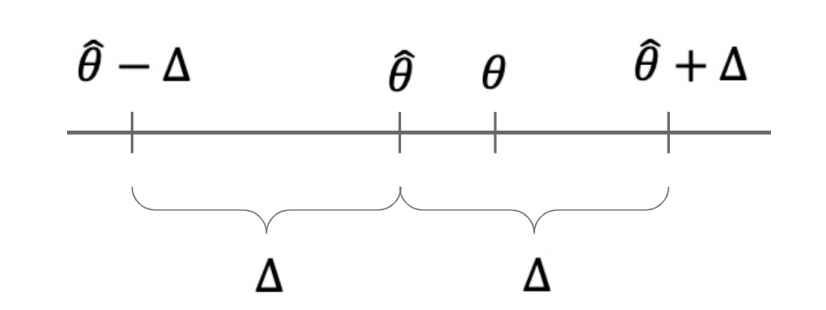

# Estimação por Intervalos: Intervalo de Confiança

## Motivação para Intervalos de Confiança

Os intervalos de confiança são utilizados no contexto frequentista, no qual os parâmetros populacionais são assumidos como desconhecidos, porém fixos, e não variáveis aleatórias. Enquanto isso, os intervalos de credibilidade (Paradigma Bayesiano) constituem a versão bayesiana dos intervalos de confiança frequentistas em que os parâmetros são tratados como variáveis aleatórias.

Quando realizamos estimação pontual (como Máxima Verossimilhança ou Método dos Momentos), a probabilidade de nossa resposta estar exatamente correta (considerando a aleatoriedade das amostras iid) é

$$P(\hat{\theta} = \theta) = 0,$$
porque $\theta$ é um número real e pode assumir uma quantidade incontável de valores. Portanto, a probabilidade de estarmos exatamente corretos é zero, embora possamos estar muito próximos do valor verdadeiro.

Em vez disso, podemos fornecer um intervalo (frequentemente, mas não necessariamente, centrado na estimativa pontual $\hat{\theta}$) tal que $\theta$ pertença a esse intervalo com alta probabilidade, por exemplo 95%:

$$P(\theta \in [\hat{\theta} - \Delta; \hat{\theta} + \Delta]) = 0{,}95.$$
O valor $\Delta$ é denominado **margem de erro** e determina a amplitude do intervalo de confiança. A expressão anterior pode ser escrita de maneiras equivalentes:

$$P\left(\theta \in [\hat{\theta} - \Delta; \hat{\theta} + \Delta]\right) = P\left(|\hat{\theta}-\theta| \leq \Delta\right) = P\left(
\hat{\theta}
\in
[\theta-\Delta,\theta+\Delta]
\right).$$

Todas essas expressões representam a probabilidade de que a distância entre o estimador e o parâmetro verdadeiro não ultrapasse $\Delta$.

O intervalo de confiança para $\theta$ pode ser representado como a Figura abaixo. Mais adiante, discutiremos como deve ser interpretado um intervalo de confiança associado a um nível de confiança específico.

## Revisão: Distribuição Normal Padrão

Grande parte da teoria dos intervalos de confiança baseia-se na distribuição normal padrão

$$
Z \sim N(0,1).
$$

Sua função distribuição acumulada é denotada por

$$
\Phi(z)=P(Z\leq z).
$$

Uma propriedade importante da distribuição normal é sua simetria:

$$
\Phi(z)=1-\Phi(-z).
$$

Para construir um intervalo central de 95%, precisamos encontrar um valor $z$ tal que 95% da área esteja entre $-z$ e $z$. O valor de $z$ pode ser encontrar usando o `R` ou usando alguma tabela da normal padrão (existem várias configurações). Como restam 5% fora do intervalo, temos:

- 2,5% à esquerda;
- 2,5% à direita.

Portanto,

$$
\Phi(z)= 0.975.
$$

Consultando uma tabela da normal padrão ou utilizando software estatístico, obtemos

$$
z=\Phi^{-1}(0.975)=1{,}96.
$$

Assim,

$$
P(-1{,}96 \leq Z \leq 1{,}96)=0{,}95.
$$

O valor 1,96 é conhecido como o valor crítico associado a um nível de confiança de 95%.

## Construção de um Intervalo de Confiança

**Exemplo:** Distribuição de Poisson

Suponha que

$$
X_1,\ldots,X_n \stackrel{iid}{\sim} \text{Poi}(\theta),
$$

em que $\theta$ é desconhecido.

Sabemos que tanto o estimador de máxima verossimilhança quanto o estimador pelo método dos momentos são dados pela média amostral

$$
\frac{1}{n}
\sum_{i=1}^{n}X_i.
$$

Como

$$
E(X_i)=\theta
\quad\text{e}\quad
Var(X_i)=\theta,
$$

segue que

$$
E(\hat{\theta})=\theta
$$

e

$$
Var(\hat{\theta}) = \frac{\theta}{n}.
$$

Pelo Teorema Central do Limite,

$$
\hat{\theta}
\approx
N\left(
\theta,
\frac{\theta}{n}
\right).
$$

Padronizando,

$$
\frac{\hat{\theta}-\theta}
{\sqrt{\theta/n}}
\approx
N(0,1).
$$

Desejamos construir um intervalo de confiança de 95%, ou seja, $0{,}95$. Utilizando o valor crítico $z_{0{,}975}=1{,}96$, obtemos

$$
\Delta = 1{,}96
\sqrt{\frac{\theta}{n}}.
$$

Como $\theta$ é desconhecido, substituímos pelo estimador $\hat{\theta}$:

$$\left[\hat{\theta} - 1{,}96
\sqrt{\frac{\hat{\theta}}{n}}
;
\hat{\theta}
+
1{,}96
\sqrt{\frac{\hat{\theta}}{n}}
\right].$$

:::{.callout-note title='Definição: Intervalo de Confiança'}

Suponha que você possua uma amostra aleatória $X_1,\ldots,X_n$ de uma distribuição com parâmetro desconhecido $\theta$, e que disponha de um estimador $\hat{\theta}$ para esse parâmetro.

Um intervalo de confiança de nível $100(1-\alpha)\%$ para $\theta$ é um intervalo (tipicamente, mas nem sempre, centrado em $\hat{\theta}$), $[\hat{\theta}-\Delta,\hat{\theta}+\Delta],$
tal que a probabilidade (considerando a aleatoriedade das amostras $X_1,\ldots,X_n$) de o parâmetro $\theta$ pertencer a esse intervalo seja igual a $1-\alpha$:

$$P\left(\theta \in [\hat{\theta} - \Delta; \hat{\theta} + \Delta]\right) = 1-\alpha.$$
Quando $\hat{\theta} = \frac{1}{n}\sum_{i=1}^{n}X_i$
é a média amostral, o Teorema Central do Limite garante que $\hat{\theta}$ possui distribuição aproximadamente normal para amostras suficientemente grandes. Nesse caso, um intervalo de confiança de nível $100(1-\alpha)\%$ é dado por

$$\left[\hat{\theta} - z_{1-\alpha/2}\frac{\sigma}{\sqrt{n}}
;
\hat{\theta}
+
z_{1-\alpha/2}\frac{\sigma}{\sqrt{n}}
\right],$$
em que $z_{1-\alpha/2}$ é o quantil da distribuição Normal padrão e $\sigma$ representa o verdadeiro desvio-padrão de uma observação da população, o qual pode precisar ser estimado a partir dos dados.
:::

É importante observar que a fórmula apresentada anteriormente funciona apenas quando $\hat{\theta}$ é a média amostral. Nesse caso, podemos utilizar o Teorema Central do Limite para concluir que a distribuição de $\hat{\theta}$ é aproximadamente normal. Quando o estimador não é a média amostral, essa aproximação pode não ser válida, sendo necessário recorrer a outras estratégias para construir intervalos de confiança.

Se desejarmos um intervalo de confiança de 95%, então $100(1-\alpha)= 95$, o que implica $\alpha=0.05$. Nesse caso, devemos encontrar o quantil da distribuição Normal padrão correspondente a $1-\frac{0.05}{2} = 0.975$. Consultando uma tabela da distribuição Normal padrão ou utilizando um software estatístico, obtemos $\Phi^{-1}(0.975)= 1.96$. Isso significa que um intervalo de confiança de 95% é obtido considerando aproximadamente 1,96 desvios-padrão para cada lado da estimativa pontual.

De maneira análoga, se desejarmos um intervalo de confiança de 98%, teremos $100(1-\alpha)=98,$ e, portanto, $\alpha=0.02$. Logo, $1-\frac{0.02}{2} = 0,99$, assim, devemos calcular $\Phi^{-1}(0.99)$. A razão para isso é simples: se desejamos que 98% da área da distribuição esteja concentrada na região central, os 2% restantes devem ser distribuídos igualmente entre as duas caudas da distribuição. Consequentemente, teremos 1% da área à esquerda e 1% da área à direita.

**Exemplo:** Intervalo de Confiança para uma Proporção

Considere uma amostra de tamanho $n=400$
de uma distribuição Bernoulli com parâmetro $\theta$.
Suponha que foram observados 136 sucessos.

A estimativa pontual é

$$\hat{\theta} =  \frac{136}{400} = 0.34.$$

Desejamos construir um intervalo de confiança de 99%. Temos

$$
\alpha = 1- \frac{99}{100} = 0.01
$$

e, portanto, $z_{0.995} = 2.576$. Como

$$
Var(X)=\theta(1-\theta),
$$

estimamos o desvio-padrão por

$$\sigma = \sqrt{\hat{\theta}(1-\hat{\theta})} =
\sqrt{0.34\times0.66} = 0.474.$$

Logo,

$$
\left[0.34 - 2.576\frac{0.474}{\sqrt{400}}
;
0.34
+
2.576\frac{0.474}{\sqrt{400}}
\right].
$$

Após os cálculos, temos 

$$
IC(\theta,0{,}99) = [0.279;0.401].
$$

## Interpretação de um Intervalo de Confiança

Uma interpretação muito comum, mas incorreta, é afirmar:

> Existe 99% de probabilidade de que $\theta$ pertença ao intervalo $[0.279;0.401]$.

Essa afirmação está errada porque $\theta$ é um parâmetro fixo. Após observarmos os dados, o intervalo já foi determinado e $\theta$ está dentro dele ou não está.

A interpretação correta é:

> Se repetirmos o procedimento de amostragem e construção do intervalo muitas vezes, aproximadamente 99% dos intervalos construídos conterão o verdadeiro valor de $\theta$.

Portanto, o nível de confiança refere-se ao método de construção do intervalo e não à probabilidade de o parâmetro pertencer ao intervalo específico obtido.